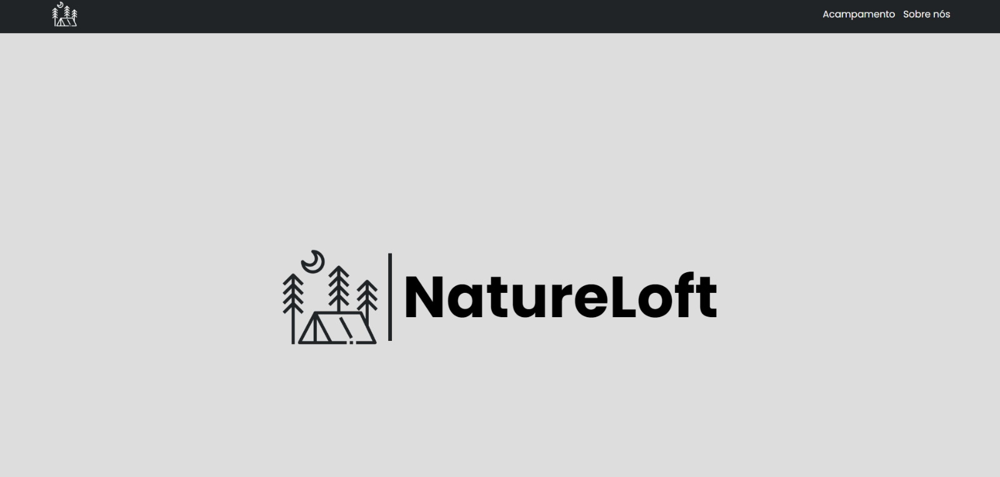
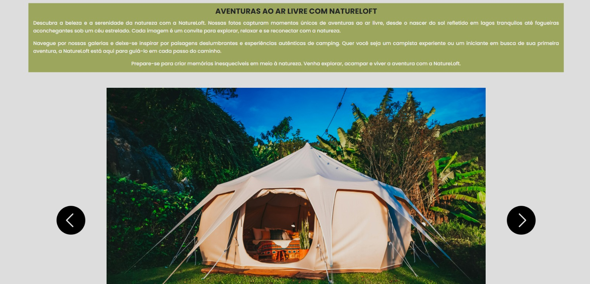

# NatureLoft - Camping Experience
NatureLoft é um projeto de website para um acampamento que oferece uma experiência única de contato com a natureza. Este repositório contém todo o código-fonte para o desenvolvimento de um site moderno e interativo, proporcionando aos visitantes informações detalhadas sobre as facilidades do acampamento, trilhas, cachoeiras, e muito mais.

#Principais Funcionalidades

Informações Detalhadas: Descrição completa das facilidades oferecidas no acampamento, como churrasqueiras, áreas para motorhomes, lagoas, cachoeiras, e trilhas.

Galeria de Vídeos: Coletânea de vídeos que mostram as belezas naturais do NatureLoft, integrados em um carrossel interativo.

Conexão com a Natureza: Promove a reconexão com a natureza, destacando a tranquilidade e as aventuras disponíveis para os campistas.

Experiência de Usuário: Interface intuitiva e responsiva, garantindo uma navegação agradável em dispositivos móveis e desktop.

https://natureloft.vercel.app/

# ALGUMAS IMAGENS DO PROJETO

